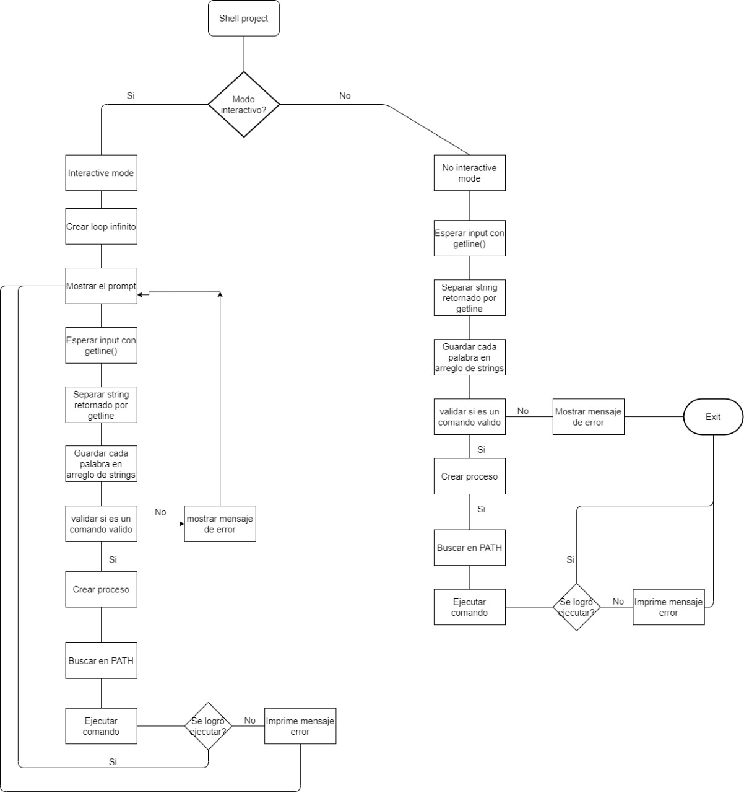
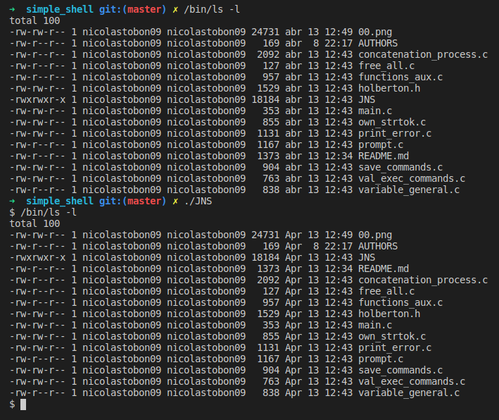
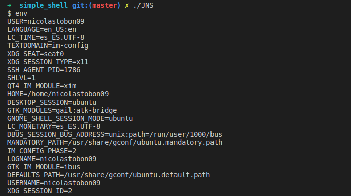

# Simple_shell

## General Shell Structure 🌎

## Description 📚

In this project, a simple UNIX command interpreter is developed using the C programming language. The following functions of a shell are discussed in the respective project:

* Interactive and non-interactive operation for the command entered in the form of an absolute path

* Input of commands in the form of absolute path, interpretation and execution

* Interpretation and execution of command flags entered in an absolute way

* Interactive and non-interactive operation for command entered without absolute path

* Input of command without absolute path, interpretation and execution

* Interpretation and execution of command flags entered in a non-absolute way

* Interpretation and execution of exit command

* Handling of the interruption signal by keyboard (ctrl + c)

* Interpretation and execution of the env command

* Interpretation and execution of the clear command

## Compilation 💻

Simple shell was compiled this way:

`gcc -Wall -Werror -Wextra -pedantic *.c -o JNS`

## Downloading 📥

You can download this repository like this:

`https://github.com/NICOLASTOBON/simple_shell.git`

## Non interactive

pass the commands in the stdin but no prints the prompt.

`$ echo "ls" | ./JNS`

## interactive

the program is execute and the prompt is print, and wait for the user.

`$ ./JNS`
`($)`

## Tasks 📝

### 3. Shell simple 0.1

* Implementation of a command interpreter that works with an absolute path without interpreting flags

* Handling the "end of file" condition (ctrl + D)

### 5. Simple shell 0.2

* Handling command lines with arguments

### 7. Simple shell 0.3

* Handling the PATH

### 8. Simple shell 0.4

* Implement the exit built-in, that exits the shell

### 10. Simple shell 0.4.2

* Handle Ctrl+C: your shell should not quit when the user inputs ^C

### 11. Simple shell 1.0

* Implement the env built-in, that prints the current environment

## Authors ✍

* **Jose Alonso Vidal Restrepo** - *GitHub user* - [JoseR98](https://github.com/JoseR98)
* **Nicolas Alvarez Tobon** - *GitHub user* - [NICOLASTOBON](https://github.com/NICOLASTOBON)
